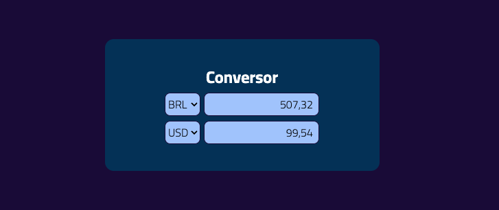

# Conversor
## _Conversor de moedas conforme cotação atual_

### Sobre
Conversor de Moedas é um projeto Web para quem deseja converter de forma simples um valor em outra moeda para a sua preferência.

### 🛠 Tecnologias usadas
 - Informações estáticas desenvolvidas com [HTML](https://developer.mozilla.org/en-US/docs/Web/HTML) e [CSS](https://developer.mozilla.org/en-US/docs/Web/CSS)
 - Campos dinâmicos desenvolvido com [TypeScript](https://www.typescriptlang.org/) e [JavaScript](https://developer.mozilla.org/en-US/docs/Web/JavaScript)
 
 ### API
 - AwasomeAPI ([Site](https://docs.awesomeapi.com.br/api-de-moedas) / [GitHub](https://github.com/raniellyferreira/awesomeapi-cep))

### 📷 Imagem do Projeto
#### Home:
